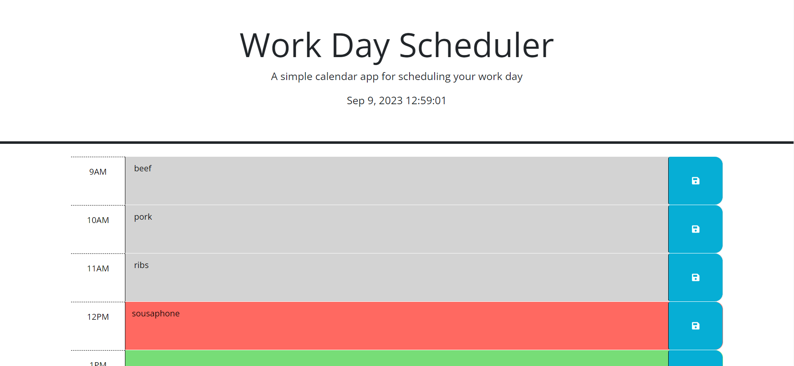

# Password Generator - John Zigterman

## Description

- I aimed to implement basic scheduling functionality in this project.
- I created javascript that added classes to the hour boxes to make clear which ones were past, present, and future.
- I implemented local storage to save previously entered information to the fields.
- Created a clock that displays current time and date at top of page.
- Built application using version control with appropriate comments.

## Installation

This is a web page and can be viewed using any web browser.

## Usage

The application can be used to schedule the user's day in a rudimentary manner.

## Credits

I, John Paul Zigterman, completed this project by myself with the aid of the resources provided to me by the MSU coding bootcamp.

## Link

https://johnpaulzigterman.github.io/workdayscheduler/

## Screenshot

## License

MIT License

Copyright (c) 2023 John Paul Zigterman

Permission is hereby granted, free of charge, to any person obtaining a copy
of this software and associated documentation files (the "Software"), to deal
in the Software without restriction, including without limitation the rights
to use, copy, modify, merge, publish, distribute, sublicense, and/or sell
copies of the Software, and to permit persons to whom the Software is
furnished to do so, subject to the following conditions:

The above copyright notice and this permission notice shall be included in all
copies or substantial portions of the Software.

THE SOFTWARE IS PROVIDED "AS IS", WITHOUT WARRANTY OF ANY KIND, EXPRESS OR
IMPLIED, INCLUDING BUT NOT LIMITED TO THE WARRANTIES OF MERCHANTABILITY,
FITNESS FOR A PARTICULAR PURPOSE AND NONINFRINGEMENT. IN NO EVENT SHALL THE
AUTHORS OR COPYRIGHT HOLDERS BE LIABLE FOR ANY CLAIM, DAMAGES OR OTHER
LIABILITY, WHETHER IN AN ACTION OF CONTRACT, TORT OR OTHERWISE, ARISING FROM,
OUT OF OR IN CONNECTION WITH THE SOFTWARE OR THE USE OR OTHER DEALINGS IN THE
SOFTWARE.